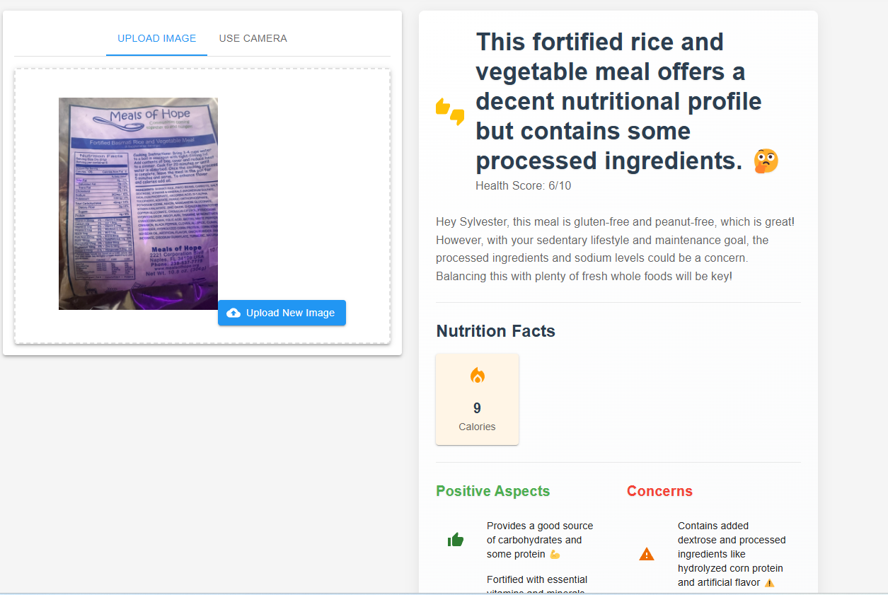

# EAT GOOD: Your AI-Powered Smart Eating Assistant 🥗

EAT GOOD is an intelligent food analysis system that combines Computer Vision and Large Language Models to provide personalized nutrition insights. The system uses Google Cloud Vision API for OCR (Optical Character Recognition) and Gemini Pro for intelligent analysis of nutrition information.

## 🌟 Features

- **Smart Image Analysis**: Extract nutrition facts from food package images using Google Cloud Vision OCR
- **Personalized Analysis**: Get customized nutrition advice based on your health profile
- **Intelligent Insights**: Advanced analysis using Gemini Pro for detailed nutritional recommendations
- **User Profiles**: Store dietary preferences, health conditions, and nutrition goals
- **Real-time Processing**: Instant analysis and feedback on food choices

## 📸 Screenshots




## ��️ Project Structure

```
├── backend/
│   ├── app/
│   │   ├── vision.py          # Google Cloud Vision integration
│   │   ├── gpt_handler.py     # Gemini Pro integration
│   │   ├── main.py           # FastAPI backend server
│   │   └── sample_images/    # Test images
│   └── requirements.txt      # Backend dependencies
├── frontend/
│   ├── src/
│   │   ├── components/       # React components
│   │   ├── services/        # API services
│   │   └── assets/         # Static assets
│   └── package.json        # Frontend dependencies
└── README.md
```

## 🛠️ Technical Stack

- **Backend**: FastAPI (Python)
- **Frontend**: React with Material-UI
- **ML/AI Services**:
  - Google Cloud Vision API (OCR)
  - Google Gemini Pro (LLM)
- **Image Processing**: OpenCV, PIL

## 🚀 Setup Instructions

### 1. Google Cloud Setup
 
1. Create a new Google Cloud Project
```bash
# Create new project
gcloud projects create [PROJECT_ID]

# Set project
gcloud config set project [PROJECT_ID]
```

2. Enable Required APIs
- Cloud Vision API
- Vertex AI API (for Gemini)
- Cloud Storage API

3. Set up Authentication
```bash
# Create service account and download key
gcloud iam service-accounts create [NAME]
gcloud projects add-iam-policy-binding [PROJECT_ID] --member="serviceAccount:[NAME]@[PROJECT_ID].iam.gserviceaccount.com" --role="roles/owner"
gcloud iam service-accounts keys create key.json --iam-account=[NAME]@[PROJECT_ID].iam.gserviceaccount.com

# Set environment variable
export GOOGLE_APPLICATION_CREDENTIALS="path/to/key.json"
```
[Read more on environmental setup from here](https://cloud.google.com/docs/authentication/set-up-adc-local-dev-environment)

### 2. Backend Setup

1. Create and activate virtual environment
```bash
python -m venv venv
source venv/bin/activate  # Linux/Mac
.\venv\Scripts\activate   # Windows
```

2. Install dependencies
```bash
cd backend
pip install -r requirements.txt
```

3. Start the backend server
```bash
uvicorn app.main:app --reload
```

### 3. Frontend Setup

1. Install dependencies
```bash
cd frontend
npm install
```

2. Start the development server
```bash
npm start
```

## 🧠 ML Engineering Details

### Vision Processing Pipeline

1. **Image Preprocessing**
   - Grayscale conversion
   - Otsu's thresholding
   - Noise removal using morphological operations
   ```python
   def preprocess_image(image_bytes):
       # Convert to grayscale
       gray = cv2.cvtColor(img, cv2.COLOR_BGR2GRAY)
       # Apply threshold
       _, thresh = cv2.threshold(gray, 0, 255, cv2.THRESH_BINARY + cv2.THRESH_OTSU)
       # Noise removal
       kernel = np.ones((1, 1), np.uint8)
       opening = cv2.morphologyEx(thresh, cv2.MORPH_OPEN, kernel)
   ```

2. **OCR Enhancement**
   - Custom regex patterns for nutrition fact extraction
   - Multiple format handling
   - Error correction mechanisms

3. **LLM Integration**
   - Context-aware prompting
   - User profile integration
   - Structured output formatting

### Performance Optimization

- Caching mechanisms for API responses
- Efficient image processing pipeline
- Optimized regex patterns for text extraction
- Error handling and logging

## 📊 System Architecture


## 🔍 API Documentation


### Vision API Endpoints

```python
POST /api/scan
- Accepts: Multipart form data (image file)
- Returns: Nutrition analysis, OCR results
```

### Profile Endpoints

```python
POST /api/user/profile
GET /api/user/profile
- Manages user dietary preferences and health goals
```
